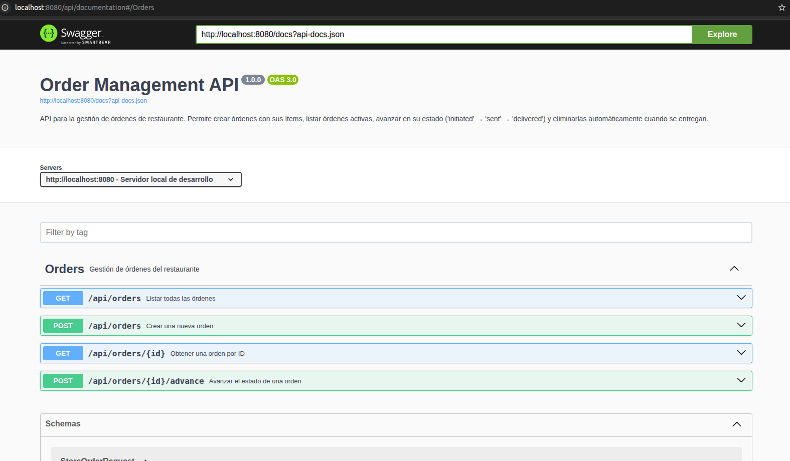

# Gestión de Órdenes API RESTful - Configuración del entorno local

Este proyecto está desarrollado con Laravel 10 siguiendo principios `SOLID` para mantener un código limpio, escalable y fácil de mantener.
Se ejecuta en un entorno completamente dockerizado, evitando instalaciones manuales y asegurando que todos los desarrolladores trabajen con la misma configuración.

Incluye los siguientes servicios y tecnologías:

- **Laravel 10**: Framework moderno para construir APIs RESTful robustas.
- **PHP 8.3**: Lenguaje base de la aplicación.
- **Redis**: Sistema en memoria para caché.
- **PostgreSQL 17**: Base de datos relacional confiable y de alto rendimiento.
- **Nginx**: Servidor web para servir la aplicación y gestionar el tráfico HTTP.
- **Swagger (OpenAPI) + L5-Swagger**: Documentación de la API, interactiva y generada automáticamente..
- **Docker Compose**: Orquestador para levantar todos los servicios con un solo comando.

---

## Índice

- [Requisitos previos](#requisitos-previos)
- [Estructura del proyecto](#estructura-del-proyecto)
- [Levantar el entorno local](#levantar-el-entorno-local)
- [Acceso a la aplicación y la documentación interactiva de la API](#acceso-a-la-aplicación-y-la-documentación-interactiva-de-la-api)
- [Notas importantes](#notas-importantes)
- [Comandos útiles](#comandos-útiles)

--- 

## Requisitos previos

Antes de comenzar, asegurate de tener instalados:

- [Docker y Docker Compose (ver guía separada)](./_readme_instalacion-docker-ubuntu.md) 
- Git

 
## Estructura del proyecto

El proyecto utiliza Laravel y se encuentra dentro del directorio `src`, siguiendo una arquitectura alineada con los principios `SOLID`.

```
.
├── docker
│   ├── nginx
│   │   └── default.conf
│   └── php
│       ├── entrypoint.sh
│       ├── php.ini-development
│       ├── php.ini-production
│       └── www.conf
├── src
│   ├── app
│   │   ├── Http
│   │   │   ├── Controllers
│   │   │   └── Requests
│   │   ├── Models
│   │   ├── Services
│   │   └── Repositories
│   └── routes
│       └── api.php
├── docker-compose.yml
└── Dockerfile

```

## Levantar el entorno local

> **Nota:** Si tienes **PostgreSQL** o **Redis** ejecutándose en tu máquina, detén temporalmente esos servicios para evitar conflictos de puertos con los contenedores del proyecto.

1 )  Clonar el repositorio:

```bash
git clone https://github.com/F1703/challenge-laravel-2025.git
cd challenge-laravel-2025
```

2 ) Construir y levantar los contenedores: 
 
```bash
sudo docker compose up -d --build
```

Esto levantará los siguientes servicios:

- **app**: PHP 8.3 + Laravel
- **db**: PostgreSQL 17
- **redis**: Redis
- **nginx**: Servidor web accesible desde `http://localhost:8080`

> Al finalizar el build e iniciar los contenedores, se ejecutarán automáticamente las migraciones y seeders, dejando la base de datos lista para usar.

Al finalizar el build deberías ver algo como:

```sql 
[+] Running 7/7
 ✔ gestion-ordenes-api-app              Built           0.0s 
 ✔ Network gestion-ordenes-api_laravel  Created         0.0s 
 ✔ Volume "gestion-ordenes-api_pgdata"  Created         0.0s 
 ✔ Container redis_server               Started         0.2s 
 ✔ Container postgres_db                Started         0.2s 
 ✔ Container laravel_app                Started         0.3s 
 ✔ Container nginx_server               Started         0.4s 

```

3 ) ¡Listo! 

El proyecto ya contiene el archivo `.env` configurado y las dependencias se instalan automáticamente en el `build`. También se aplican las migraciones al iniciar el contenedor.

---

## Acceso a la aplicación y la documentación interactiva de la API

1 ) Aplicación y endpoints de la API:\
  `http://localhost:8080`

2 ) Interfaz de prueba interactiva para la API (documentación generada automáticamente):\
  `http://localhost:8080/api/documentation`

En la interfaz de Swagger podrás:

- Consultar todos los endpoints disponibles.
- Revisar parámetros, tipos de datos y posibles respuestas.
- Probar solicitudes directamente desde el navegador, sin necesidad de Postman u otras herramientas externas.


📸 *Vista previa de la documentación generada automáticamente con Swagger*  



---
 

## Notas importantes

- Las migraciones y seeders se ejecutan automáticamente al iniciar el contenedor, garantizando un entorno listo para pruebas sin pasos manuales adicionales.
- Se incluyen tests automatizados con PHPUnit para asegurar la calidad del código.
- Para ejecutar los tests dentro del contenedor, usa:
  
```bash
sudo docker compose exec app ./vendor/bin/phpunit
```


## Preguntas y respuestas

### ¿Cómo asegurarías que esta API escale ante alta concurrencia?

Ya tenemos lo basico que seria el uso de cache con redis, la base de datos tiene algunos indices suficientes y necesarios, aplicamos SOLID esto nos facilita separar cada componente de manera independiente, utilizamos Docker lo cual nos permitira replicar instancias facilmente, se podria integrar Jobs y Queues para las operaciones pesadas, y ademas podriamos integrar algunas herramientas para el monitorio y la observabilidad (Grafana, Prometheus, etc) esto nos permitira detectar cuellos de botellas, medir latencia, tasa de errores y activar alertas. Y algo que considero que potenciará significativamente el rendimiento de la API es la implementacion de Laravel Octane con Swoole ya que esto permitirá responder miles de solicitudes concurrentes con menor latencia optimizando los recursos del servidor.

--- 

### ¿Qué estrategia seguirías para desacoplar la lógica del dominio de Laravel/Eloquent?

Usar el patrón Repository es un forma ideal para desacoplar la lógica del dominio de Laravel y Eloquent.

Este patrón permite separar el acceso a datos mediante interfaces, de modo que la lógica de negocio no dependa directamente del ORM o la base de datos. 

Asi, se facilitaria el mantenimiento, las prubas y la flexibilidad para cambiar la implementación sin afectar al resto de la aplicación

--- 

### ¿Cómo manejarías versiones de la API en producción?

Para manejar versiones de la api utlizaria versionado en la url, considero que es lo mas común.

Por ejemplo: `/api/v1/orders`, `/api/v2/orders`.

En las rutas utilizarlo de esta manera: `Route::prefix('v1')`
Mantener una documentacion separada para cada version. 

